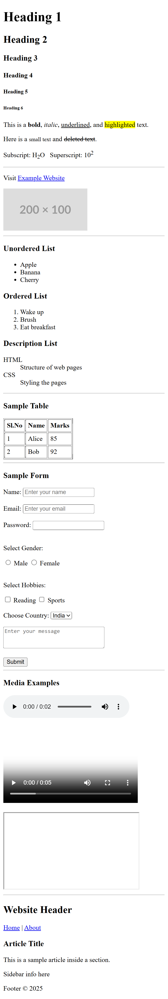

# HTML Basics - Learning All Tags

This project contains a single HTML file demonstrating **all the basic HTML tags** in one place.  
It helps beginners learn and practice HTML step by step.

---

## 📌 Features Covered
- **Headings** (`<h1>` to `<h6>`)
- **Text Formatting** (bold, italic, underline, small, delete, mark, subscript, superscript)
- **Links & Images**
- **Lists**
  - Unordered List (`<ul>`)
  - Ordered List (`<ol>`)
  - Description List (`<dl>`)
- **Table**
- **Forms** (input fields, radio buttons, checkboxes, dropdown, textarea, submit button)
- **Media**
  - Audio
  - Video
  - Iframe
- **Semantic Elements**
  - Header, Nav, Main, Section, Article, Aside, Footer
---
## 🖼️ Screenshot
## 📸 Screenshots

